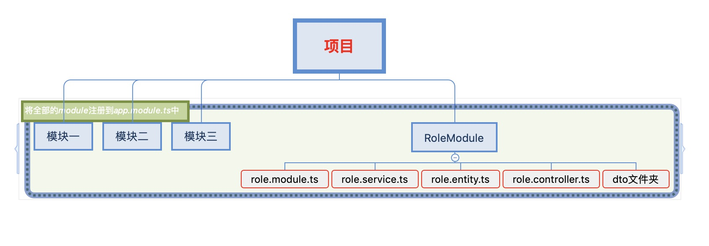
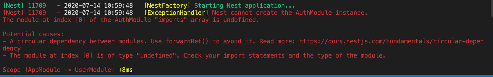

# nestjs

## 下载脚手架

```bash
npm i -g @nestjs/cli
```

## 创建项目

### 一 项目基本介绍

1. 使用脚手架创建项目

    ```bash
    nest new nest-base
    ```

2. 初始化项目文件介绍
    ```bash
    .
    ├── README.md
    ├── nest-cli.json # nest-cli的配置
    ├── package-lock.json
    ├── package.json
    ├── src  # 项目文件
    │   ├── app.controller.spec.ts # 控制器的单元测试文件(可以删除)
    │   ├── app.controller.ts # 控制器文件(可以删除)
    │   ├── app.module.ts # 入口的module(不能删除)
    │   ├── app.service.ts # 服务层文件(可以删除)
    │   └── main.ts # 项目入口文件(不能删除)
    ├── test # 测试文件(可以删除)
    │   ├── app.e2e-spec.ts
    │   └── jest-e2e.json
    ├── tsconfig.build.json
    └── tsconfig.json # tsconfig的配置文件
    ```

### 二 关于 nestjs 项目架构

**1. 架构解释**


* 我们可以在项目中定义很多控制层
* 客户端(浏览器、移动设备)发送http请求,根据url匹配的原则,到对应的控制器
* 控制器继续访问到服务层
* 服务层对接数据层,然后对数据的增删改查

**2. 实际中构建大型项目架构**



### 三 基础项目解释

**1. 项目结构**

```bash
➜  src git:(master) tree
.
├── app.controller.spec.ts # 测试文件，可以先不看
├── app.controller.ts # 控制器
├── app.module.ts # 主模块
├── app.service.ts # 服务层
└── main.ts # 入口文件

0 directories, 5 files
```

**2. main.ts 文件**

```js
import { NestFactory } from '@nestjs/core';
import { AppModule } from './app.module';

async function bootstrap() {
  // 使用NestFactory工厂创建一个app应用并且传递一个AppModule模块进去,类似我们使用express框架一样的先创建一个app
  const app = await NestFactory.create(AppModule);
  // 监控端口,运行项目后浏览器直接访问localhost:3000
  await app.listen(3000);
}
bootstrap();
```

**3. app.module.ts 文件**

```js
import { Module } from '@nestjs/common';
import { AppController } from './app.controller';
import { AppService } from './app.service';

@Module({
  imports: [], // 依赖外面的模块(可以是自己创建的比如userModule，或者是官方提供的比如typeorm, graphql,或者第三方的)
  controllers: [AppController], // 该模块所用到的控制器
  providers: [AppService], // 该模块的提供者
  exports: [], // 别的模块要使用该模块中的某几个方法，就要在这里对外暴漏
})
export class AppModule {}
```

**4. app.controller.ts 文件**

```js
import { Controller, Get } from '@nestjs/common';
import { AppService } from './app.service';

@Controller() // 使用nestjs的装饰器装饰表示该类是一个控制器
export class AppController {
  constructor (
    // 使用依赖注入的方式注入一个类
    private readonly appService: AppService
  ) { }

  @Get() // 定义http的请求方式为get请求
  getHello(): string { // 函数名可以随便定义
    return this.appService.getHello(); // 控制层调用服务层的getHello()方法
  }
}
```

5. app.service.ts 文件

```js
import { Injectable } from '@nestjs/common';

@Injectable()
export class AppService {
  getHello(): string {
    // 现在直接返回一个字符串,实际开发中这里调用typeorm中的方法对数据库进行curd操作
    return 'Hello World!';
  }
}
```

## 依赖注入概念

### 一 依赖注入的概念

**1. 概念**

依赖注入(DI)是用来创建对象及其依赖的其它对象的一种方式。 当依赖注入系统创建某个对象实例时，会负责提供该对象所依赖的对象(称为该对象的依赖)。思想来源于angular

**2. 功能**

服务提供上@Injectable @Injectable装饰器会指出这些服务或其它类是用来注入的(比如一些工具方法)。它还能用于为这些服务提供配置项。

### 二 常见的定义提供器的方式 【[参考](https://github.com/kuangshp/nest-book-code/tree/01.di/nest-base)】

**1. 基本方式（也是最常见的）**

```js
providers: [AppService]
// 使用方式直接依赖注入就可以
constructor (
  private readonly appService: AppService,
) { }
```

**2. useClass 方式**

```js
providers: [
  { 
    provide: AppService, 
    useClass: AppService 
  }
]
// 使用方式直接依赖注入就可以
constructor (
  private readonly appService: AppService,
) { }
```

**3. provide 定义字符串方式**

```js
  AppService,
  {
    provide: 'LOG',
    useClass: LoggerService
  }
],
// 使用方式需要使用@Inject的方式
constructor (
  private readonly appService: AppService,
  @Inject('LOG') readonly loggerService: LoggerService
) { }

@Get()
getHello(): string {
  this.loggerService.log('日志');
  return this.appService.getHello();
}
```

**4. 使用 useFactory 工厂方式**

```js
@Module({
  imports: [],
  controllers: [AppController],
  providers: [
    {
      provide: 'LOG',
      useClass: LoggerService
    },
    {
      provide: 'APP_SERVICE',
      useFactory: (logger) => {
        logger.log('使用工厂方式');
        return '工厂方法返回';
      },
      inject: ['LOG'] // 注入的顺序就是useFactory函数的顺序
    }
  ],
  exports: []
})

// 使用方式
@Controller()
export class AppController {
  constructor (
    @Inject('APP_SERVICE') readonly appService: AppService,
    @Inject('LOG') readonly loggerService: LoggerService
  ) { }

  @Get()
  getHello(): string {
    this.loggerService.log('日志');
    console.log(this.appService);
    return 'nestjs';
  }
}
```

**5. 使用 useValue 方式**

```js
providers: [
  ...
  {
    provide: 'IS_DEV',
    useValue: { isDev: true }
  }
],
...
// 使用
@Controller()
export class AppController {
  constructor (
    @Inject('IS_DEV') readonly isDev: { isDev: boolean },
  ) { }

  @Get()
  getHello(): string {
    console.log(this.isDev);
    return 'nestjs';
  }
}
```

## nestjs 中模块的认识

### 一 [官网地址](https://docs.nestjs.com/modules)

### 二 关于 nestjs 中 module 的认识

1. 在前面介绍到  nestjs项目是由很多个 module 来组装成一个大项目的，类似现在前端框架是由很多的组件组装成一个项目。

2. 来自官网介绍模块的图


  * 一个项目只能有一个根模块app.module.ts这个模块
  * 一个项目可以由多个模块组成
  * 模块之间可以相互的引入

3. 模块的使用

* 在 nestjs 中模块是使用 @Module 装饰器装饰的一个类
* 在@ Module 中可接收一个对象，用来描素该模块的功能

| 名称 | 描述  |
|  ----  | ----  |
| `imports`  | 该模块依赖其它的模块, 以数组的方式，表示可以多个
 |
| `controllers`  | 该模块在定义的控制器, 以数组的方式，表示可以多个
 |
| `providers`  | 为该模块提供功能的提供者, 以数组的方式，表示可以多个
 |
| `exports`  | 该模块需要对外暴漏出去给别的模板使用的功能, 以数组的方式，表示可以多个
 |

### 三 自定义业务模块

1. 直接使用命令创建一个module

    ```bash
    # 在modules的文件夹下创建一个用户模块
    nest g mo modules/user
    ```

    ```bash
    # 创建后的提示语
    ➜  nest-base git:(02.module) ✗ nest g mo modules/user
    CREATE src/modules/user/user.module.ts (81 bytes)  # 表示创建的文件所在的位置
    UPDATE src/app.module.ts (317 bytes) # 更新了那个文件(会自动在app.module.ts的import中引入当前创建的module)
    ➜  nest-base git:(02.module) ✗ 
    ``` 

2. 在 module 中创建属于该 module 下面的控制器和服务层

    ```bash
    `# 创建不带测试文件的控制器
    ➜  nest-base git:(02.module) ✗ nest g co modules/user --no-spec
    CREATE src/modules/user/user.controller.ts (97 bytes)
    UPDATE src/modules/user/user.module.ts (167 bytes)
    # 创建不带测试文件的服务层
    ➜  nest-base git:(02.module) ✗ nest g s modules/user --no-spec         
    CREATE src/modules/user/user.service.ts (88 bytes)
    UPDATE src/modules/user/user.module.ts (241 bytes)
    ➜  nest-base git:(02.module) ✗ 
    ```

3. 上面说过 app.controller.ts 和 app.service.ts 是非必须文件，我们删除的时候要注意在 app.module.ts 中也要删除依赖引入

4. 在 user.controller.ts 中添加一个访问用户列表的方法

    ```js
    import { Controller, Get } from '@nestjs/common';
    import { UserService } from './user.service';

    @Controller('user')
    export class UserController {
      constructor (
        private readonly userService: UserService,
      ) { }

      /**
       * @Get([path])当前的path会拼接到@Controller('user')到里面user的路径后面，不写就表示为空的
      */
      @Get()
      // userList这个方法名随便自己定义,要见文思意就可以
      async userList(): Promise<any[]> {
        // 控制层访问服务层的userList方法
        return await this.userService.userList();
      }
    }
    ```

5. 在 user.service.ts 中定义与控制器对接的 userList 方法(模拟返回点数据)

    ```js
    import { Injectable } from '@nestjs/common';

    @Injectable()
    export class UserService {
      async userList(): Promise<any[]> {
        return [
          {
            id: 0,
            name: '张三'
          },
          {
            id: 1,
            name: '李四'
          }
        ]
      }
    }
    ```

6. 运行项目

  ```bash
  npm run start:dev
  ```

7. 浏览器上直接访问localhost:3000/user

### 四 自定义模块之间的相互引入

1. 在上面的基础上创建一个日志模块及服务

    > 官方在@nestjs/common中提供了一个 Logger 日志模块，这仅仅是做演示模块之间的引入

2. 在 log.service.ts 中定义日志打印的方法

3. 在 LogModule 模块以为的模块使用到上面定义的 log 和 error 方法就要在 LogModule 中对外暴露出去

4. 在 app.module.ts 中删除 LogModule 的引入

5. 在 user.module.ts 中引入 LogModule 模块

6. 在 user.controller.ts 中使用 LogService

7. 注意点：如果要使用模块外的提供者而为引入模块会提示错误或者引入的模块中没有外暴露出来的提供者

### 五 全局模块

1. [参考文档](https://docs.nestjs.com/modules#global-modules)

2. 全局模块的定义方式

    > 在普通模块的上面添加一个@Global()的装饰器,对外暴露想暴露的提供者,就那么简单

3. 为什么要使用全局模块

    > 项目比较大，一些公共模块，会在项目很多个模块中需要引入的情况下

4. 如何使用全局模块

    * 直接在 app.module.ts 中的  import中添加全局模块
    * 在需要使用全局模块中暴露的提供者，不需要在该模块中 import
    * 直接依赖注入就可以
  
5. [代码参考地址](https://github.com/kuangshp/nest-book-code/tree/03.global_module)

### 六 动态模块

1. 官网地址[地址1](https://docs.nestjs.com/modules#dynamic-modules)[地址2](https://docs.nestjs.com/fundamentals/dynamic-modules)

2. 使用动态模块的场景

    > 需要向模块中传递参数的情况下，我们就要使用动态模块，不传递参数就使用普通模块即可

3. 动态模块中常见的2个静态方法,选择用其中一个就可以

    * register()
    * forRoot()

**使用 register 静态方法创建一个日志的动态模块**

1. 定义模块

    ```js
    import { Module, DynamicModule } from '@nestjs/common';
    import { LogService } from './log.service';

    @Module({})
    export class LogModule {
    // register函数中可以接收外部传递过来的变量,或者对象
    static register(prefix: string): DynamicModule {
        return {
        module: LogModule,
        providers: [
            LogService,
            // 使用useValue的方式在模块中注入一个变量,可以理解为在该模块中注入了别的模块,只是注入的方式不是采用import
            // 而是采用模块调用静态方法的方式
            {
            provide: 'PREFIX',
            useValue: prefix
            }
        ],
        // 动态模块一样的也要对外暴露出去
        exports: [LogService]
        }
    }
    }
    ```

2. 在日志中使用当前模块提供的变量

    ```js
    import { Injectable, Inject } from '@nestjs/common';

    @Injectable()
    export class LogService {
    constructor (
        @Inject('PREFIX') private readonly prefix: string, // 依赖注入的方式
    ) { }

    log(str: string): void {
        console.log(`${this.prefix}-${str}`);
    }
    }
    ```

3. 在 user.module.ts 使用动态模块

    ```js
    @Module({
    imports: [
        LogModule.register('user')
    ],
    controllers: [UserController]
    })
    export class UserModule { }
    ```

    4. 控制器上使用和之前一样的使用
    ```js
    @Controller('user')
    export class UserController {
    constructor (
        private readonly logService: LogService,
    ) { }

    @Get()
    hello(): string {
        this.logService.log('hello的控制器');
        return 'hello word';
    }
    }
    ```

5. [参考代码](https://github.com/kuangshp/nest-book-code/tree/04.dynamic_module/nest-base)

**使用 forRoot 静态方法的方式创建一个日志模块**

1. 使用方式和 register 一样的
2. 两者之间的区别[网上也没具体介绍](https://stackoverflow.com/questions/59358741/are-there-any-differences-between-using-forroot-or-register-when-creating-a)
3. [参考代码](https://github.com/kuangshp/nest-book-code/tree/04.dynamic_module_02/nest-base)


### 七 解决模块之间的循环依赖

1. [官方文档](https://docs.nestjs.com/fundamentals/circular-dependency#module-forward-reference)

2. 比较常见的场景

    > 用户模块和授权模块,登录用户登录了，我们要给该用户授权(就依赖了授权模块),授权模块又要根据用户信息来授权(依赖了用户模块),这样就造成一个循环依赖的关系

3. 创建用户模块和授权模块,并且创建对应的服务与暴露出去

4. 在用户的控制器中注入授权的服务

5. 在授权的服务层注入用户的服务

6. 直接提示错误,并且提示你错误解决参考地址

    

7. 在相互引模块的地方采用

    ```js
    imports: [forwardRef(() => AuthModule)],
    ```

8. [参考代码https://github.com/kuangshp/nest-book-code/tree/05.module/nest-

### 八 官方提供的 module

[使用方式见各自文档](https://github.com/nestjs)


## nestjs 生命周期钩子函数（使用频率低）

### 一 [官网地址](https://docs.nestjs.com/fundamentals/lifecycle-events)

### 二 常见的生命周期

所有应用程序元素都有一个由 Nest 管理的生命周期。Nest 提供了生命周期钩子，提供了对关键生命时刻的可见性，以及在关键时刻发生时采取行动的能力。

1. 常见的生命周期钩子函数

    | 名称 | 描述 |
    | --- | ---- |
    | onModuleInit() | 初始化主模块后调用 |
    | onApplicationBootstrap() | 	在应用程序完全启动并引导后调用 | 
    | onModuleDestroy() | 在 Nest 销毁主模块( app.close() 方法之前进行清理) | 
    | beforeApplicationShutdown() | 响应系统信号(当应用程序关闭时，例如SIGTERM) |

2. 使用方式

    ```js
    import { Injectable, OnModuleInit } from '@nestjs/common';

    @Injectable()
    export class UsersService implements OnModuleInit {
        onModuleInit() {
            console.log(`The module has been initialized.`);
        }
    }
    ```